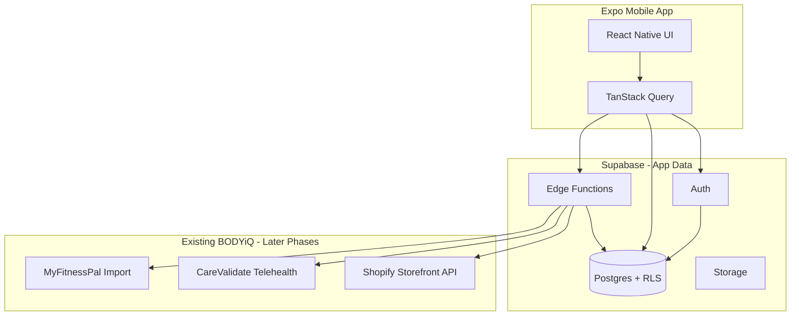
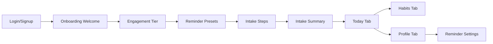

# BODYiQ Mobile App — Build Plan

## Strategic framing

This is a **mobile-first wellness app** (not web for now) positioned for payor distribution (UHC, BCBS). Every architectural choice should reinforce:

- **Simplicity default** — tiered complexity is opt-in, never forced
- **Truth and light** — commerce surfaces only what the user needs; no dark-pattern upsells
- **User-controlled engagement** — reminder frequency and coaching intensity set at onboarding

Spanish localization, voice-everywhere, AI features, body-scan integrations, and payor enrollment are **planned but deferred** to later phases.

---

## Pre-build: Cursor rules & Journal (runs first)

Before any Expo scaffolding, set up repo conventions so every future session has full product context and a running diary of work.

### `.cursor/rules/` — duplicate plan context for the agent

Create [`.cursor/rules/`](.cursor/rules/) with focused `.mdc` rule files (one concern each, under ~50 lines where possible). These embed the plan so the agent does not lose context between sessions.

| File | Scope | Purpose |
|------|-------|---------|
| [`bodyiq-product.mdc`](.cursor/rules/bodyiq-product.mdc) | `alwaysApply: true` | Guiding principles (simplicity default, truth & light, no upsell fatigue), payor context, bilingual/voice deferred |
| [`bodyiq-roadmap.mdc`](.cursor/rules/bodyiq-roadmap.mdc) | `alwaysApply: true` | Full phase roadmap (0–5) with Phase 1 MVP scope and explicit out-of-scope items |
| [`bodyiq-stack.mdc`](.cursor/rules/bodyiq-stack.mdc) | `alwaysApply: true` | Expo + TypeScript + Supabase hybrid architecture, design tokens (`#C37663`), key tables |
| [`bodyiq-mobile.mdc`](.cursor/rules/bodyiq-mobile.mdc) | `globs: app/**,src/**` | Expo Router patterns, NativeWind theme usage, TanStack Query + Zustand conventions |
| [`bodyiq-journal.mdc`](.cursor/rules/bodyiq-journal.mdc) | `globs: Journal/**` | How to write and update journal entries after each work chunk |

**Sync rule:** When the plan changes (new phases, scope shifts), update `bodyiq-roadmap.mdc` and add a Journal entry noting what changed. The rules are the living duplicate of the plan inside the repo.

Example frontmatter for always-on rules:

```yaml
---
description: BODYiQ product principles and positioning
alwaysApply: true
---
```

Example frontmatter for file-scoped rules:

```yaml
---
description: Expo mobile conventions for BODYiQ app
globs: app/**,src/**
alwaysApply: false
---
```

### `Journal/` — daily work diary

Structure mirrors your reference screenshot: year subfolder + one markdown file per day. Dates display as **mm/dd/yyyy**; filenames use filesystem-safe dashes (`MM-DD-YYYY.md`) since `/` is invalid in paths.

```
Journal/
├── README.md                 # How the journal works
└── 2026/
    └── 06-24-2026.md         # First entry — plan + pre-build setup
```

**[`Journal/README.md`](Journal/README.md)** explains:
- One file per calendar day, grouped under `Journal/YYYY/`
- Filename format: `MM-DD-YYYY.md` (maps to display date `MM/DD/YYYY`)
- Each file starts with `# MM/DD/YYYY` as the title
- Work is segmented with `##` headings per chunk (e.g. `## Phase 0 — Expo scaffold`, `## Supabase migrations`)
- Agent must append a new section (not overwrite) when resuming work the same day
- New day = new file

**Entry template** (used for every journal file):

```markdown
# 06/24/2026

## Pre-build — Cursor rules & Journal setup
- Created `.cursor/rules/` with product, roadmap, stack, mobile, and journal rules
- Created `Journal/` structure and this first entry
- Source plan: `docs/plans/bodyiq-mobile-app.md`

## [Next chunk title]
- What was done
- Files touched
- Notes / blockers
```

**Agent workflow rule** (in `bodyiq-journal.mdc`): After completing any meaningful chunk of work, open or create today's Journal file and add a `##` section summarizing what was done, files changed, and any blockers. If the chunk spans plan phases, tag it with the phase name.

### Updated project structure (top level)

```
biq-app-attempt/
├── .cursor/
│   └── rules/                    # Agent rules duplicating plan context
├── Journal/
│   ├── README.md
│   └── 2026/
│       └── MM-DD-YYYY.md
├── app/                          # (Phase 0+)
├── src/
├── supabase/
└── ...
```

---

## Recommended stack

| Layer | Choice | Why |
|-------|--------|-----|
| Mobile framework | **Expo SDK 52+** (React Native + TypeScript) | Fastest path to iOS/Android, OTA updates, strong ecosystem for camera, notifications, voice |
| Navigation | **Expo Router** (file-based) | Matches React mental model; deep linking for notifications and telehealth return URLs |
| Styling | **NativeWind v4** (Tailwind for RN) + design tokens | Consistent BODYiQ theme; easy to maintain copper gradient system |
| Server state | **TanStack Query** | Cache profile, plan, habits; sync with Supabase realtime where useful |
| Client state | **Zustand** | Onboarding wizard state, UI prefs, engagement tier |
| Forms | **React Hook Form + Zod** | 15+ min intake with step validation |
| Backend (app data) | **Supabase** | Auth, Postgres, RLS, storage (progress pics, lab uploads later), Edge Functions |
| Existing BODYiQ | **Shopify Storefront API**, **CareValidate** (Phase 4+) | Catalog, checkout, telehealth — not in Phase 1 |
| Push notifications | **Expo Notifications** + Supabase Edge Function scheduler | Respects user frequency presets |
| Voice input | **@react-native-voice/voice** or Expo speech APIs | Scaffold in Phase 1 shell; wire to forms in Phase 2+ |

**Why Expo over bare React Native:** You get one codebase, EAS Build for App Store/Play Store without maintaining native project files day-to-day, and a clear upgrade path. You still need Xcode for iOS simulator and Android Studio for Android emulator.

---

## What you need installed locally (one-time setup)

### Required on your Mac

1. **Node.js 20 LTS** — `node -v` should be v20+
2. **Xcode** (App Store) — for iOS Simulator and App Store builds
   - After install: open Xcode once, accept license, install iOS Simulator
   - Install Xcode Command Line Tools: `xcode-select --install`
3. **Android Studio** — for Android emulator (optional if iOS-only during dev)
   - Install an Android Virtual Device (AVD) via Device Manager
4. **Watchman** (recommended): `brew install watchman`
5. **EAS CLI**: `npm install -g eas-cli`

### Accounts (needed before App Store submission, not Day 1)

- **Apple Developer Program** — $99/year (required for TestFlight + App Store)
- **Google Play Console** — $25 one-time
- **Expo account** — free tier works for dev; EAS Build uses Expo cloud
- **Supabase project** — free tier for dev; production plan + BAA if handling PHI

### First-run commands (Phase 0 — we execute after plan approval)

```bash
npx create-expo-app@latest . --template tabs   # or blank + add router manually
npx expo install expo-router expo-font expo-splash-screen
npm install nativewind tailwindcss
eas init
```

---

## BODYiQ design system

Extract from [bodyiq.com](https://bodyiq.com): dark/black backgrounds, white text, copper accent `#C37663`.

Create [`src/theme/tokens.ts`](src/theme/tokens.ts):

```typescript
export const colors = {
  black: '#0A0A0A',
  white: '#FFFFFF',
  copper: {
    base: '#C37663',
    light: '#D4957F',
    dark: '#A85F4D',
  },
  gray: {
    100: '#F5F5F5',
    500: '#737373',
    900: '#171717',
  },
} as const;

export const gradients = {
  copper: ['#C37663', '#A85F4D'] as const,
  copperSubtle: ['#C37663', '#0A0A0A'] as const,
};
```

- **Primary buttons / CTAs:** copper gradient on black
- **Surfaces:** black or near-black (`#0A0A0A`, `#171717`)
- **Text:** white primary, gray-500 secondary
- **Typography:** clean sans-serif (Inter or SF Pro via system font initially)
- Build reusable primitives: `Button`, `Card`, `Screen`, `GradientBorder`, `ProgressStepper` (for onboarding)

---

## Hybrid backend architecture



**Supabase owns:** user profiles, intake answers, engagement settings, daily plans, habits, reminders, progress data, file uploads (labs, body scans — later).

**Edge Functions proxy** external APIs (Shopify, CareValidate) so API keys never ship in the mobile app.

**Row Level Security (RLS):** every table scoped to `auth.uid()` — critical before any PHI-adjacent data.

### Core Phase 1 schema (Supabase migrations)

| Table | Purpose |
|-------|---------|
| `profiles` | Extends auth.users: name, engagement_tier, reminder_preset, tracking_level, locale |
| `intake_responses` | JSONB sections: goals, health_history, dietary_prefs, lifestyle, activity |
| `daily_plans` | Date-keyed plan snapshot: workouts, meals, supplements, habits for "Today's Plan" |
| `habit_logs` | User habit completions (water, steps, stretching) with date + value |
| `reminder_settings` | Channel (push/sms/email later), frequency, quiet hours |

Engagement tiers map to presets:

- **Light** — weekly check-in, minimal nudges
- **Moderate** — daily Today's Plan summary, supplement reminders
- **High-touch** — multiple daily touchpoints (still user-configurable frequency cap)

---

## Project structure

```
biq-app-attempt/
├── app/                          # Expo Router screens
│   ├── (auth)/                   # login, signup
│   ├── (onboarding)/             # multi-step intake wizard
│   ├── (tabs)/                   # main app: today, habits, profile
│   └── _layout.tsx
├── src/
│   ├── components/               # UI primitives + feature components
│   ├── theme/                    # tokens, gradients
│   ├── hooks/                    # useProfile, useTodayPlan, useHabits
│   ├── lib/                      # supabase client, query client
│   ├── services/                 # API layer (supabase + future integrations)
│   └── types/                    # shared TS types + Zod schemas
├── supabase/
│   ├── migrations/
│   └── functions/                # Edge Functions (Phase 4+)
├── assets/                       # logo, fonts, splash
├── app.config.ts                 # Expo config, bundle IDs
├── eas.json                      # build profiles
└── tailwind.config.js            # NativeWind + BODYiQ tokens
```

**Bundle IDs (suggested):** `com.bodyiq.app` (iOS + Android) — confirm with BODYiQ legal/branding before first EAS build.

---

## Phase roadmap

### Phase 0 — Foundation (Week 1)
**Goal:** Runnable app shell with BODYiQ theme, auth, and CI-ready structure.

- Initialize Expo + TypeScript + Expo Router + NativeWind
- Implement design tokens and base UI components (black/white/copper)
- Configure Supabase project: Auth (email + magic link or email/password), client env vars
- Splash screen + app icon (BODYiQ branding)
- Tab shell: placeholder screens for Today, Habits, Profile
- EAS project init + development build profile
- Document local dev in README: `npx expo start`, iOS simulator, Android emulator

**Deliverable:** App opens to branded login; authenticated user sees empty tab shell.

---

### Phase 1 — Onboarding, Today's Plan, Habits (Weeks 2–5) — **Your chosen MVP**
**Goal:** First shippable experience: complete intake, see personalized daily dashboard, log basic habits.

#### 1a. Onboarding & intake
- Multi-step wizard (8–12 steps) with **"This takes 15+ minutes"** upfront
- Steps: welcome → engagement tier (light/moderate/high-touch) → reminder questionnaire (3 presets + frequency) → goals → health history → dietary prefs → food likes/dislikes → lifestyle → activity level → summary
- Save progress to Supabase (resume if user exits)
- `tracking_level` default = 1 (minimal); macro detail is opt-in later
- Zod validation per step; progress bar throughout

#### 1b. Profile & settings
- Profile screen: view/edit engagement tier and reminder settings
- Notification permission flow tied to chosen preset (Expo Notifications)

#### 1c. Today's Plan dashboard
- Daily view surfacing: today's habits, placeholder workout/meal/supplement slots (content can be static/seeded initially)
- "Coach" tone copy — accountability without nagging
- Pull plan from `daily_plans` table (seed via Edge Function or admin script from intake data)
- Empty state for new users: "Your plan is being built from your intake"

#### 1d. Basic habit tracking
- Default habits: water, steps (manual entry for now — HealthKit/Google Fit in Phase 3), stretching
- Simple check-off or numeric entry (tier-1 UX: one tap)
- History view (last 7 days)
- Habits respect engagement tier (fewer prompts for "light")

#### 1e. Reminders (MVP scope)
- Push notifications for Today's Plan summary and supplement placeholder reminders
- Frequency capped by user's onboarding preset
- Quiet hours setting in profile

**Phase 1 deliverable:** TestFlight-ready build where a user can sign up, complete intake, see Today's Plan, log habits, and receive appropriately spaced push reminders.

**Explicitly NOT in Phase 1:** store, telehealth, food photo/barcode, body scan, AI, community, Spanish, MyFitnessPal, calendar sync.

---

### Phase 2 — Nutrition (Weeks 6–9)
- Tiered food tracking (Levels 1–5); ship Levels 1–2 first
- Barcode scanner (`expo-camera` + nutrition API)
- Photo-of-food macro estimation (AI vision API via Edge Function)
- Supplement reminders wired to real products (Shopify catalog read-only)
- Meal planning shell + chain restaurant guides (static content first)
- Voice logging on food entry forms

---

### Phase 3 — Fitness & Training (Weeks 10–13)
- Workout programs from intake + goals (Hyrox, CrossFit, marathon, cycling templates)
- **Real-person demo videos** (not avatar) — prioritize content pipeline
- Exercise library with technique notes
- Workout logging on Today's Plan
- HealthKit / Google Fit step sync
- Muscle recovery heat map (UI + data model; integration TBD)

---

### Phase 4 — Commerce, Telehealth, Patient Portal (Weeks 14–18)
- Shopify Storefront API: supplements, tests, GLP-1/peptide catalog
- CareValidate telehealth checkout (in-catalog flow)
- Patient portal: plan, prescriptions, subscriptions, service history
- Longevity Report: manual lab upload → storage + report view
- Edge Functions for secure API proxying

---

### Phase 5 — AI, Integrations, Scale (Weeks 19+)
- Real-time nutrition AI ("I'm at Chipotle…") — context from user plan via RAG
- Premium AI trainer: Q&A → accept → writes to plan
- Body scan integrations (Zozofit, MeThreeSixty, bodymapp) — evaluate one vendor first
- MyFitnessPal import
- Calendar sync (plan events, refills, appointments)
- BiQ community
- Spanish (i18n with `expo-localization` + `i18next`)
- Payor enrollment flows (employer/payer codes, SSO if required)
- HIPAA/BAA review with legal before payor pilot

---

## Phase 1 screen map



---

## Key technical decisions to lock in Phase 0

1. **Auth method:** Email + password (simplest for MVP) vs magic link — recommend email/password with optional magic link later
2. **Plan generation:** Phase 1 uses rule-based plan seeding from intake JSON (not AI) — fast, predictable, "truth and light"
3. **SMS reminders:** Defer to Phase 2+ (requires Twilio + compliance); push-only in Phase 1
4. **Offline:** TanStack Query persistence for habit logs (nice-to-have in Phase 1)
5. **Env vars:** `EXPO_PUBLIC_SUPABASE_URL`, `EXPO_PUBLIC_SUPABASE_ANON_KEY` in `.env`; secrets only in Edge Functions

---

## Compliance note (payor context)

Before UHC/BCBS pilot, plan for:
- Supabase **BAA** (Business Associate Agreement) if storing health-adjacent data
- Privacy policy + terms aligned with wellness (not medical device) positioning
- CareValidate and Shopify flows may have their own HIPAA/compliance requirements
- App Store health category disclosures

This does not block Phase 0–1 development but should be on the roadmap before payor deployment.

---

## Success criteria for Phase 1

- [ ] App runs on iOS Simulator and Android emulator with BODYiQ theme
- [ ] User can register, complete full intake, and resume if interrupted
- [ ] Engagement tier + reminder preset stored and editable
- [ ] Today's Plan shows daily content derived from intake
- [ ] User can log water/steps/stretching habits with 7-day history
- [ ] Push notifications respect frequency preset (no notification fatigue in testing)
- [ ] Supabase RLS verified: users only see their own data
- [ ] TestFlight build submitted via EAS
