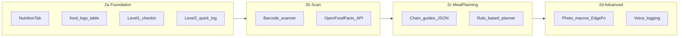

# Phase 2 — Nutrition Build Plan

## Where you are

**Done:** Phase 0 + Phase 1 core (auth, intake, Today's Plan, habits, profile).

**Leverage now:**
- Intake already captures `dietary_prefs`, `food_likes`, `goals` in [`intake_responses`](supabase/migrations/20260624150000_initial_schema.sql)
- [`profiles.tracking_level`](src/types/database.ts) exists (1–5) but is always `1` and not exposed in UI yet
- Today's Plan already has a **Meals** section in [`daily_plans`](src/services/profile.ts) — nutrition should feed back into this

**Guiding principle (unchanged):** Level 1 is the default. Macro detail and barcode/photo are opt-in via `tracking_level`.

---

## Recommended structure: 4 sub-phases (~3–4 weeks)

---

## Phase 2a — Nutrition foundation (Week 1)

**Goal:** A fourth tab with tiered UX; Level 1–2 shippable.

### Navigation
- Add **Nutrition** tab to [`app/(tabs)/_layout.tsx`](app/(tabs)/_layout.tsx) (fork/knife icon)
- New screen: [`app/(tabs)/nutrition.tsx`](app/(tabs)/nutrition.tsx)

### Supabase migration
New table `food_logs`:

| Column | Type | Notes |
|--------|------|-------|
| `id` | uuid | PK |
| `user_id` | uuid | FK, RLS |
| `log_date` | date | unique per day for Level 1 check-ins |
| `meal_type` | enum | breakfast, lunch, dinner, snack |
| `name` | text | optional for Level 1 |
| `calories` | numeric | optional |
| `protein_g` / `carbs_g` / `fat_g` | numeric | Level 2+ only |
| `source` | text | manual, barcode, photo |
| `completed_checkin` | boolean | Level 1 "ate on plan" toggle |

RLS: same pattern as [`habit_logs`](supabase/migrations/20260624150000_initial_schema.sql).

### Tiered UX (ship Levels 1–2)

| Level | UX | Default |
|-------|-----|---------|
| **1** | One daily question: "How did you eat today?" (On plan / Mostly / Off plan). No macro UI. | Yes |
| **2** | Quick meal log: name + optional calories; simple daily total. No macro grid. | Opt-in |

**Level selector:** Add to [`app/(tabs)/profile.tsx`](app/(tabs)/profile.tsx) — "Food tracking detail" with plain-language labels (not "Level 1–5"). Persist to `profiles.tracking_level`.

### Today's Plan integration
- Show today's nutrition check-in status on [`app/(tabs)/today.tsx`](app/(tabs)/today.tsx) under Meals (e.g. "Logged" / "Not yet")
- When Level 1 check-in completes, mark meal slot on plan as done

### Services / hooks
- [`src/services/nutrition.ts`](src/services/nutrition.ts) — CRUD for `food_logs`
- [`src/hooks/useNutrition.ts`](src/hooks/useNutrition.ts) — TanStack Query wrappers

**2a deliverable:** Nutrition tab works; Level 1 users get one tap; Level 2 users can log meals; Profile can change tracking level.

---

## Phase 2b — Barcode scanner (Week 2)

**Goal:** Level 2+ users can scan packaged food (effortless logging).

### Dependencies
- `npx expo install expo-camera` (camera permissions in [`app.config.ts`](app.config.ts))

### Flow
1. "Scan barcode" button on Nutrition tab (hidden if `tracking_level < 2`)
2. Camera scans EAN/UPC
3. Lookup via **Open Food Facts API** (free, no API key) — fallback message if not found
4. Pre-fill meal log with name + calories + macros; user confirms one tap

### Files
- [`app/nutrition/scan.tsx`](app/nutrition/scan.tsx) — modal/stack screen
- Extend `food_logs.source = 'barcode'`

**2b deliverable:** Scan → confirm → saved to today's log.

---

## Phase 2c — Meal planning + chain guides (Week 3)

**Goal:** Working professionals get actionable "what to eat" without meal prep — no AI required yet.

### Static chain guides (truth and light)
- [`src/data/restaurants/`](src/data/restaurants/) — JSON per chain (start with **Chipotle, Sweetgreen, Chick-fil-A, Starbucks**)
- Each entry: item name, calories, protein, tags (`high_protein`, `low_carb`, etc.)
- Filter by user's `dietary_prefs` from intake (no upsell language)

### Meal planning screen
- [`app/nutrition/meal-plan.tsx`](app/nutrition/meal-plan.tsx)
- **Rule-based** suggestions from intake:
  - `dietary_prefs.diet_type`, `food_likes.likes`, `goals.primary_goal`
  - 3 sample meals/day for the week (static templates, personalized copy)
- Link from Nutrition tab: "Meal ideas" and " Eating out guide"

### Today's Plan tie-in
- Seed [`daily_plans.meals`](src/services/profile.ts) from meal plan on onboarding complete (replace generic placeholders)

**2c deliverable:** Browse chain guides; see a simple weekly meal idea list derived from intake.

---

## Phase 2d — Photo macros + voice (Week 4, optional stretch)

**Goal:** Level 3+ features; defer if 2a–2c take longer.

### Photo-of-food
- Supabase **Edge Function** + vision API (OpenAI or similar) — never ship API keys in the app
- Camera capture → estimate calories + protein/fat/carbs
- Only shown when `tracking_level >= 3`

### Voice logging
- `@react-native-voice/voice` or Expo speech — wire to quick-log form
- Phase 2 stretch; not blocking 2a–2c

### Levels 3–5 (later within Phase 2)
- **Level 3:** Custom nutrient set chosen at profile setup
- **Level 4:** Full macro grid + daily targets
- **Level 5:** Power-user nutrient breakdown

Ship 3–5 only after 1–2 feel effortless in testing.

---

## Phase 1 loose ends (parallel, not blocking)

Do these when convenient — not required to start 2a:

| Item | Why |
|------|-----|
| `eas init` + real `projectId` | Remote push tokens (you hit this on Build My Plan) |
| Mark Today's Plan items complete | Tap to check off habits/meals/workouts |
| Daily plan auto-refresh | Edge Function or client check: new `plan_date` → seed new plan |
| Journal entry | Log Phase 1 sign-off in [`Journal/`](Journal/) |

---

## What we are NOT building in Phase 2

- Shopify supplement catalog (Phase 4)
- Real-time "I'm at Chipotle" AI (Phase 5)
- MyFitnessPal import (Phase 5)
- Full macro customization UI for Levels 4–5 until 1–2 are validated

---

## Suggested build order (first sprint = 2a)

1. Supabase migration: `food_logs`
2. Nutrition tab + Level 1 check-in
3. Profile tracking level selector
4. Level 2 quick log
5. Today's Plan nutrition status chip
6. Update [`.cursor/rules/bodyiq-roadmap.mdc`](.cursor/rules/bodyiq-roadmap.mdc) → "Phase 2 in progress"
7. Journal entry when 2a ships

---

## Success criteria for Phase 2a (first milestone)

- [ ] Nutrition tab visible; Level 1 is default for new users
- [ ] Level 1: one-tap daily eating check-in saves to Supabase
- [ ] Level 2: user can log at least one meal with name (+ optional calories)
- [ ] Profile: user can opt into more detail (tracking level 2)
- [ ] Today's Plan reflects nutrition check-in status
- [ ] RLS verified on `food_logs`

---

## Success criteria for full Phase 2

- [ ] Levels 1–2 polished; 3+ gated behind opt-in
- [ ] Barcode scan logs packaged food
- [ ] Chain restaurant guides browsable (4+ chains)
- [ ] Rule-based meal suggestions from intake data
- [ ] Meals on Today's Plan feel personalized, not generic placeholders
