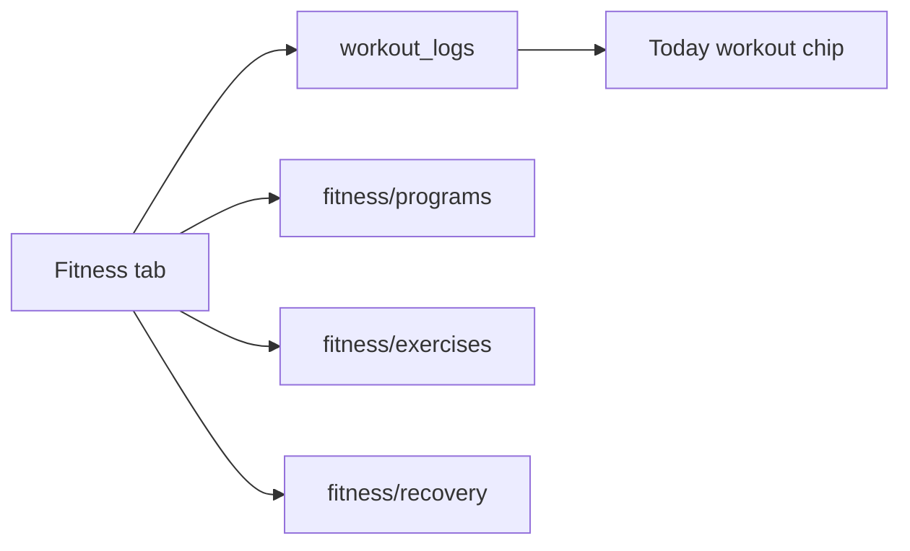

# Phase 3 — Fitness Base Layout

## Recommendation

**Yes — workouts/fitness is next.** It is Phase 3 in the [master roadmap](bodyiq-mobile-app.md) and follows naturally after Nutrition.

| Domain | Tab | Logging | Today's Plan | Sub-routes |
|--------|-----|---------|--------------|------------|
| Nutrition (done) | Nutrition | `food_logs` | Meals + chip | scan, meal-plan, photo, voice |
| **Fitness (next)** | **Fitness** | **`workout_logs`** | **Workout + chip** | **programs, exercises, recovery** |

**Guiding principle:** default to a one-tap daily movement check-in; programs, detailed logging, and device sync are opt-in (reuse `profiles.tracking_level >= 2` for detail, same as Nutrition).

---

## Leverage now

- Intake: `activity.activity_level`, `activity.preferred_activities`, `goals` in [`intake_responses`](../../supabase/migrations/20260624150000_initial_schema.sql)
- [`daily_plans.workouts`](../../src/services/profile.ts) seeds one generic workout — replace with rule-based suggestions via new [`workoutPlanner.ts`](../../src/services/workoutPlanner.ts) (mirror [`mealPlanner.ts`](../../src/services/mealPlanner.ts))
- Patterns to copy: [`app/(tabs)/nutrition.tsx`](../../app/(tabs)/nutrition.tsx), [`app/nutrition/_layout.tsx`](../../app/nutrition/_layout.tsx), [`src/services/nutrition.ts`](../../src/services/nutrition.ts)

---

## Architecture

---

## Phase 3a — Foundation

- **Tab:** Add Fitness to [`app/(tabs)/_layout.tsx`](../../app/(tabs)/_layout.tsx) (between Nutrition and Profile)
- **Screen:** [`app/(tabs)/fitness.tsx`](../../app/(tabs)/fitness.tsx)
- **Migration:** `supabase/migrations/20260624170000_workout_logs.sql`
  - Columns: `user_id`, `log_date`, `checkin_status` (on_plan/mostly/off_plan), `workout_type` (strength/cardio/mobility/sport/other), `title`, `duration_minutes`, `notes`, `source`, `completed_checkin`
  - RLS same as `food_logs`; partial unique index for one daily check-in per user per day
- **Level 1:** "How did movement go today?" — three chips
- **Level 2:** Quick log (type + duration + optional title)
- **Services:** [`src/services/fitness.ts`](../../src/services/fitness.ts), [`src/hooks/useFitness.ts`](../../src/hooks/useFitness.ts)
- **Today:** Workout status chip on [`app/(tabs)/today.tsx`](../../app/(tabs)/today.tsx); check-in marks `daily_plans.workouts` complete

---

## Phase 3b — Programs (shell + static JSON)

- [`src/data/programs/index.ts`](../../src/data/programs/index.ts) — 4–6 templates (mobility, strength, Hyrox-style, marathon/cycling) filtered by intake
- [`app/fitness/programs.tsx`](../../app/fitness/programs.tsx) — list
- [`app/fitness/program/[id].tsx`](../../app/fitness/program/[id].tsx) — detail + "Start program" stub
- Link from Fitness tab: **Browse programs**

---

## Phase 3c — Exercise library (shell + placeholders)

- [`src/data/exercises/index.ts`](../../src/data/exercises/index.ts) — ~15–20 movements with technique notes, `video_url: null`
- [`app/fitness/exercises.tsx`](../../app/fitness/exercises.tsx) — searchable list
- [`app/fitness/exercise/[id].tsx`](../../app/fitness/exercise/[id].tsx) — detail + "Demo video coming soon"

---

## Phase 3d — Recovery (shell only)

- [`app/fitness/recovery.tsx`](../../app/fitness/recovery.tsx) — mock muscle heat map + copy deferring HealthKit/Google Fit
- Link from Fitness tab (Level 2+)

**Deferred:** HealthKit sync, real demo videos, program enrollment/progression.

---

## Cross-cutting (recommended same sprint)

**Tap-to-complete on Today's Plan** — cards in [`today.tsx`](../../app/(tabs)/today.tsx) become pressable; add `updatePlanItemCompletion` in [`profile.ts`](../../src/services/profile.ts) + mutation in [`usePlan.ts`](../../src/hooks/usePlan.ts). Benefits all domains.

---

## Build order

1. Migration `workout_logs`
2. Services, hooks, workoutPlanner
3. Fitness tab + `app/fitness/_layout.tsx` with back button
4. All sub-screens (stub then fill static content)
5. Today's Plan chip + tap-to-complete
6. Journal (implementation complete)

---

## Success criteria

- Fitness tab in tab bar (5 tabs)
- Level 1 check-in and Level 2 log save to Supabase
- Today Workout section shows status; check-in marks workout done
- All routes navigable with back to Fitness: programs, program detail, exercises, exercise detail, recovery
- Personalized workout copy on onboarding seed
- RLS on `workout_logs` applied remotely

## Not in this sprint

Real-person videos, HealthKit/Google Fit, live recovery data, AI trainer, adaptive programs.
