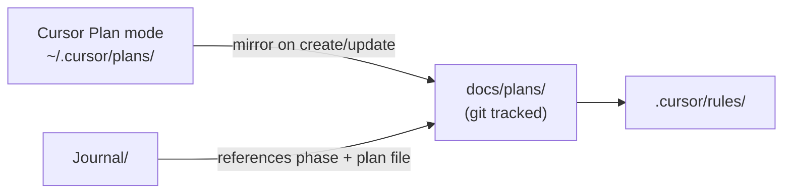

# Repo Plans Documentation Setup

## Problem

Cursor Plan mode writes plans to your **user folder**, not the repo:

```
/Users/stoney.harward/.cursor/plans/
├── bodyiq_mobile_app_f5f6dcb0.plan.md   ← Phase 0/1 master plan
└── phase_2_nutrition_9a454316.plan.md   ← Phase 2 plan
```

The repo already tracks daily work in [`Journal/`](Journal/) and agent context in [`.cursor/rules/`](.cursor/rules/), but **plans are not in git** — bad for documentation and collaboration.

---

## Target structure

```
biq-app-attempt/
├── docs/
│   └── plans/
│       ├── README.md                      # How plans relate to Cursor + Journal
│       ├── bodyiq-mobile-app.md           # Master plan (Phase 0–5)
│       └── phase-2-nutrition.md           # Current active plan
├── Journal/
│   └── 2026/
│       └── MM-DD-YYYY.md
└── .cursor/
    └── rules/
        ├── bodyiq-plans.mdc               # NEW — sync workflow
        └── ...
```

Use **human-readable filenames** in the repo (no Cursor UUID suffixes). Cursor keeps its own copies in `~/.cursor/plans/`; the repo is the source of truth for documentation.

---

## Files to create (first sync)

| Repo path | Source (Cursor) |
|-----------|-----------------|
| [`docs/plans/bodyiq-mobile-app.md`](docs/plans/bodyiq-mobile-app.md) | `~/.cursor/plans/bodyiq_mobile_app_f5f6dcb0.plan.md` |
| [`docs/plans/phase-2-nutrition.md`](docs/plans/phase-2-nutrition.md) | `~/.cursor/plans/phase_2_nutrition_9a454316.plan.md` |
| [`docs/plans/README.md`](docs/plans/README.md) | New — explains layout + sync rules |

When copying, **strip YAML frontmatter** (todos/status metadata) from the repo copies OR keep it — recommend **keeping frontmatter** so plan status is visible in git; strip only if it feels noisy.

---

## [`docs/plans/README.md`](docs/plans/README.md) contents

- Purpose: version-controlled build plans for BODYiQ
- **Cursor canonical path:** `~/.cursor/plans/` (IDE Plan mode)
- **Repo path:** `docs/plans/` (git-tracked documentation)
- **Journal path:** `Journal/` (daily work log)
- **Agent rules:** `.cursor/rules/` (condensed context for the agent)
- Sync rule: when a plan is created or materially updated, mirror it here
- Link to active plan: currently `phase-2-nutrition.md`
- Phase index:
  - `bodyiq-mobile-app.md` — Phases 0–5 master roadmap
  - `phase-2-nutrition.md` — active sprint

---

## New agent rule: [`.cursor/rules/bodyiq-plans.mdc`](.cursor/rules/bodyiq-plans.mdc)

```yaml
---
description: Keep repo plan docs in sync with Cursor plans
globs: docs/plans/**
alwaysApply: true
---
```

Content (concise):
- After creating/updating a Cursor plan, copy to `docs/plans/` with a readable filename
- Update [`bodyiq-roadmap.mdc`](.cursor/rules/bodyiq-roadmap.mdc) if phase scope changes
- Add a Journal entry noting plan changes
- Master plan = `docs/plans/bodyiq-mobile-app.md`; active sprint plan = latest phase file

---

## Updates to existing files

| File | Change |
|------|--------|
| [`Journal/README.md`](Journal/README.md) | Point "Source plan" to `docs/plans/bodyiq-mobile-app.md` instead of `~/.cursor/plans/...` |
| [`.cursor/rules/bodyiq-roadmap.mdc`](.cursor/rules/bodyiq-roadmap.mdc) | Add line: full plans live in `docs/plans/` |
| [`.cursor/rules/bodyiq-journal.mdc`](.cursor/rules/bodyiq-journal.mdc) | Note: reference `docs/plans/` when logging phase work |
| [`README.md`](README.md) | Add "Documentation" section linking `docs/plans/` and `Journal/` |

---

## Ongoing workflow



1. **New plan in Cursor** → copy to `docs/plans/<readable-name>.md` → commit with code changes
2. **Plan iteration** → update repo copy in same PR/commit
3. **Phase completes** → Journal entry + optional "Status: complete" note at top of plan file
4. **New phase** → new file in `docs/plans/` (e.g. `phase-3-fitness.md`)

---

## Execution order (before Phase 2a coding)

1. Create `docs/plans/` + README
2. Copy both existing BODYiQ plans into repo
3. Add `bodyiq-plans.mdc` rule
4. Update Journal README, roadmap rule, root README
5. Journal entry: `## Docs — Plans mirrored to repo`
6. Then proceed with Phase 2a implementation

---

## What this does NOT do

- Does not move Cursor's internal plan storage (that stays in `~/.cursor/plans/`)
- Does not auto-sync on every Cursor edit unless the agent follows the rule (manual + agent-assisted)
- Does not replace `.cursor/rules/` — rules stay short; plans stay detailed in `docs/plans/`
